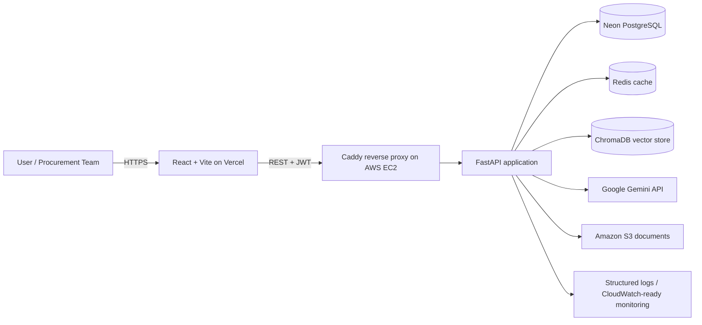

<div align="center">

# SourceWise — AI Procurement Intelligence Platform

**A deployed full-stack platform for BOM-based sourcing, supplier optimization, procurement risk analysis, scenario simulation, and evidence-grounded AI recommendations.**

[](https://react.dev/)
[](https://fastapi.tiangolo.com/)
[](https://www.postgresql.org/)
[](https://aws.amazon.com/ec2/)
[](https://github.com/features/actions)

[Live application](https://source-wise-ai-procurement-platform-fawn.vercel.app) · [API documentation](https://sourcewise-35-175-11-218.nip.io/docs) · [Repository](https://github.com/YASHIKA-ASH/SourceWise-AI-Procurement-Platform)

> The deployed application is authentication-protected. Demo credentials are intentionally not stored in the repository.

</div>


## Overview

SourceWise converts product, inventory, supplier, quotation, capacity, cost, risk, and delivery data into an explainable procurement plan.

Instead of selecting a supplier only by unit price, the platform evaluates **landed cost, quality, lead time, risk exposure, approval status, certification, minimum order quantity, available capacity, delivery feasibility, budget, and target margin**. It can split a component requirement across multiple suppliers when a single supplier cannot satisfy the order.

The project was built to demonstrate practical full-stack engineering across business logic, APIs, data modelling, security, AI retrieval, cloud deployment, testing, and observability.

## Core capabilities

### Procurement planning

- Create products and maintain target manufacturing cost, selling price, procurement budget, and minimum profit margin.
- Enter BOM components manually or import BOM files in CSV/XLSX format.
- Calculate net purchasing requirements from gross demand, current inventory, reserved inventory, and safety stock.
- Store detailed supplier profiles, capacity, performance, certifications, approval status, and historical risk indicators.
- Record supplier quotations with unit price, freight, customs, tax, packaging, warehousing, and delay-related costs.
- Calculate complete landed cost rather than comparing only quoted unit prices.

### Supplier recommendation engine

SourceWise supports four procurement strategies:

- **Balanced** — weighted cost, quality, lead-time, and risk scoring.
- **Lowest cost** — minimizes calculated landed cost.
- **Lowest risk** — prioritizes safer suppliers.
- **Fastest delivery** — prioritizes procurement lead time.

The allocation engine applies business constraints including supplier approval, ISO certification, minimum quality, maximum risk, MOQ, production capacity, maximum order size, domestic sourcing, supplier-share limits, and required delivery dates.

### Scenario simulation

Users can test procurement assumptions such as:

- demand increases or reductions;
- supplier price volatility;
- transport-cost changes;
- delivery delays;
- supplier unavailability;
- domestic-only sourcing;
- alternate scoring weights and sourcing strategies.

### 500-scenario improvement benchmark

The platform includes a repeatable Monte Carlo benchmark that compares a baseline sourcing process with a selected SourceWise strategy across randomized purchasing scenarios.

Each strategy receives the same demand, price, transport, lead-time, and supplier-disruption shocks. The benchmark reports:

- procurement-cost reduction;
- supplier-risk reduction;
- quality-score improvement;
- supplier-dependency reduction;
- on-time allocation and full-allocation success;
- profit-margin change;
- strategy win rates;
- P10, median, and P90 cost distributions.

The displayed percentages are calculated from the configured procurement data and simulation results—they are not hard-coded claims. Results are simulated estimates rather than measured production savings.

### AI procurement copilot

- Builds a live procurement knowledge index from products, BOMs, supplier offers, calculated allocations, costs, schedules, and risk records.
- Uses ChromaDB retrieval to find evidence relevant to the user’s question.
- Uses Google Gemini to generate an explanation grounded in the retrieved procurement records.
- Returns supporting source chunks alongside each answer for traceability.

Example questions:

- Why was this supplier allocation recommended?
- Which component is delaying production?
- Where can landed cost be reduced?
- Does the current sourcing plan meet the target margin?

### Enterprise-oriented security

- JWT access and rotating refresh tokens.
- Argon2 password hashing.
- Role-based access control for `viewer`, `analyst`, `manager`, and `admin` users.
- Redis-backed login rate limiting, token revocation, and API caching.
- Audit events for mutating requests.
- Configurable CORS and secure production environment validation.
- Presigned Amazon S3 upload/download workflow when an S3 bucket is configured.

## System architecture



## Technology stack

| Layer | Technologies |
|---|---|
| Frontend | React 19, Vite, JavaScript, responsive CSS |
| Backend | Python, FastAPI, Pydantic, SQLAlchemy 2 |
| Database | Neon PostgreSQL; SQLite supported for local development |
| Authentication | JWT, rotating refresh tokens, Argon2 |
| AI/RAG | Google Gemini, ChromaDB |
| Cache and rate limiting | Redis |
| File storage | Amazon S3 presigned uploads/downloads |
| Deployment | Vercel, AWS EC2, Docker Compose, Caddy HTTPS proxy |
| Testing and CI | Pytest, frontend production build, GitHub Actions |

## Important calculations

### Net procurement requirement

```text
Usable inventory = Current inventory - Reserved inventory
Net purchase requirement = Gross demand + Safety stock - Usable inventory
```

### Weighted supplier score

```text
Supplier score =
    Cost score × Cost weight
  + Quality score × Quality weight
  + Lead-time score × Lead-time weight
  + Risk desirability score × Risk weight
```

Risk is stored as exposure from 0 to 100. The recommendation engine converts it to desirability using `100 - risk exposure`, so a safer supplier receives a higher score.

### Landed cost

```text
Landed cost =
    Material cost
  + Transportation
  + Customs / import duty
  + Packaging
  + Warehousing
  + Tax
  + Expected delay-related cost
```

## Selected API routes

```text
GET    /auth/status
POST   /auth/login
POST   /auth/refresh
POST   /auth/logout
GET    /auth/me

GET    /products
POST   /products
POST   /products/{product_id}/bom/upload
GET    /suppliers
POST   /components/{component_id}/offers

GET    /analysis/products/{product_id}/recommendation
POST   /analysis/products/{product_id}/scenario
POST   /analysis/products/{product_id}/benchmark

POST   /ai/products/{product_id}/index
POST   /ai/products/{product_id}/ask

POST   /files/presign-upload
POST   /files/complete
GET    /admin/audit-events
GET    /health/ready
```

Interactive Swagger documentation is available at `/docs` when the backend is running.

## Run locally

### Prerequisites

- Python 3.12+
- Node.js 22+
- Git
- Redis, optional but recommended
- A PostgreSQL/Neon connection, or SQLite for local development

### 1. Clone the repository

```powershell
git clone https://github.com/YASHIKA-ASH/SourceWise-AI-Procurement-Platform.git
cd SourceWise-AI-Procurement-Platform
```

### 2. Configure and start the backend

```powershell
cd backend
python -m venv .venv
.\.venv\Scripts\Activate.ps1
python -m pip install --upgrade pip
pip install -r requirements.txt
Copy-Item .env.example .env
```

For a simple local database, set this in `backend/.env`:

```env
ENVIRONMENT=development
DATABASE_URL=sqlite:///./sourcewise-dev.db
FRONTEND_ORIGINS=http://localhost:5173
SEED_DEMO_DATA=true
JWT_SECRET_KEY=replace-with-a-long-random-development-secret
INITIAL_ADMIN_EMAIL=admin@example.com
INITIAL_ADMIN_PASSWORD=replace-with-a-strong-password
INITIAL_ADMIN_NAME=SourceWise Administrator
REDIS_URL=redis://localhost:6379/0
GEMINI_API_KEY=
CHROMA_PATH=./chroma_db
```

Generate a stronger JWT secret with:

```powershell
python -c "import secrets; print(secrets.token_urlsafe(64))"
```

Start the API:

```powershell
python -m fastapi dev app/main.py
```

Backend: `http://localhost:8000`  
API docs: `http://localhost:8000/docs`

### 3. Start Redis locally

```powershell
docker run --name sourcewise-redis -p 6379:6379 -d redis:7.4-alpine
```

The application can run without Redis, but caching, login rate limiting, and immediate access-token revocation operate in degraded mode.

### 4. Configure and start the frontend

Open another terminal:

```powershell
cd frontend
npm install
Set-Content .env.local "VITE_API_URL=http://localhost:8000"
npm run dev
```

Frontend: `http://localhost:5173`

## Run tests

Backend tests:

```powershell
cd backend
.\.venv\Scripts\Activate.ps1
python -m pytest -q
```

Frontend production build:

```powershell
cd frontend
npm run build
```

GitHub Actions runs backend tests and the frontend production build for pushes and pull requests.

## Production deployment

The current deployment uses:

- **Frontend:** Vercel
- **Backend:** Dockerized FastAPI on AWS EC2
- **HTTPS reverse proxy:** Caddy
- **Database:** Neon PostgreSQL
- **Cache:** Redis in the EC2 Docker Compose network

Important production settings:

```env
ENVIRONMENT=production
FRONTEND_ORIGINS=https://your-vercel-domain.vercel.app
DATABASE_URL=postgresql://...
JWT_SECRET_KEY=<long-random-secret>
REDIS_URL=redis://redis:6379/0
GEMINI_API_KEY=<optional-gemini-key>
```

Never commit `.env`, credentials, database URLs, JWT secrets, administrator passwords, or cloud keys.

## Repository structure

```text
SourceWise-AI-Procurement-Platform/
├── .github/workflows/       # CI workflow
├── backend/
│   ├── app/
│   │   ├── routers/         # Auth, products, suppliers, analysis, AI, storage
│   │   ├── services/        # Procurement, AI/RAG, benchmark, S3 services
│   │   ├── main.py
│   │   ├── models.py
│   │   └── models_enterprise.py
│   ├── scripts/
│   ├── tests/
│   └── requirements.txt
├── frontend/
│   ├── public/
│   ├── src/
│   │   ├── components/
│   │   ├── App.jsx
│   │   ├── AuthGate.jsx
│   │   └── BenchmarkView.jsx
│   ├── package.json
│   └── vercel.json
├── deploy/                  # EC2, S3, IAM and observability configuration
├── docker-compose.yml
└── README.md
```

## Engineering highlights

- Modelled real procurement constraints instead of using a basic supplier ranking demo.
- Separated calculated recommendation logic from AI-generated explanations.
- Added deterministic simulations through a reusable random seed.
- Used identical shocks for baseline and optimized strategies to make benchmark comparisons fairer.
- Implemented refresh-token rotation, RBAC, rate limiting, auditability, and request tracing.
- Deployed a split frontend/backend architecture across Vercel and AWS EC2 with HTTPS and CORS configuration.
- Added automated build and test validation through GitHub Actions.

## Limitations and next steps

- Benchmark results are simulated estimates and require real purchasing history for production validation.
- The current allocation engine can be extended with mathematical programming for globally optimal allocations across larger datasets.
- Historical purchase-order ingestion would enable trend analysis and forecast calibration.
- Production hardening can be improved with AWS Secrets Manager, managed Redis, alarms, automated backups, and a custom domain.

## Maintainer

Maintained by [YASHIKA-ASH](https://github.com/YASHIKA-ASH).

---

<div align="center">
Built to demonstrate full-stack engineering, cloud deployment, procurement-domain modelling, explainable AI, and secure API design.
</div>
